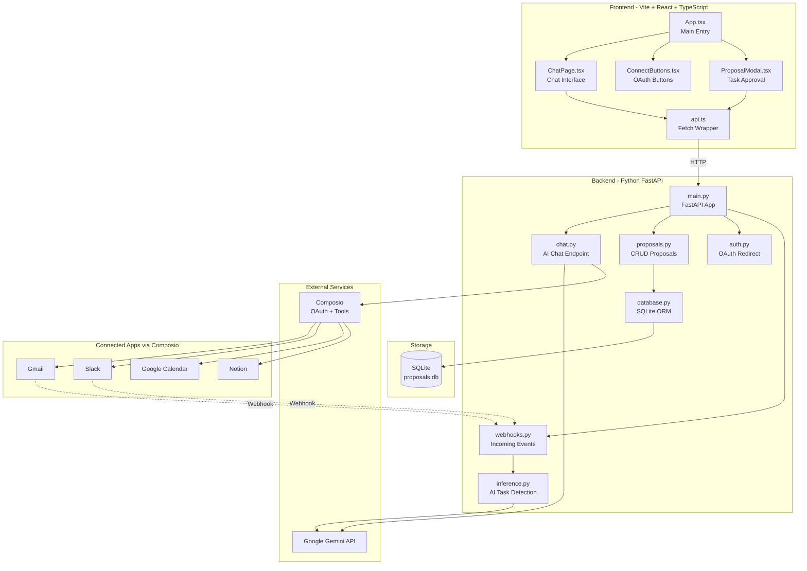

# Simplified Orbital Architecture

## Overview

A streamlined rewrite of Orbital using your team's preferred stack. This design eliminates external dependencies like Redis, removes streaming complexity, and consolidates the architecture into two clear services.

---

## Architecture Comparison

| Aspect | Current (Complex) | Simplified |

|--------|-------------------|------------|

| Frontend | Next.js 14 (SSR, API routes) | Vite + React + TypeScript |

| Backend | Next.js API Routes + Server Actions | Python FastAPI (single server) |

| Storage | Upstash Redis (external service) | SQLite (file-based, zero config) |

| AI Chat | Vercel AI SDK with streaming | Direct Gemini API, simple request/response |

| AI Inference | Two-stage (classify → extract) | Single-stage structured extraction |

| Deployment | Vercel (serverless) | Any VPS, Docker, or cloud |

**Complexity Reduction:**

- 1 external service (Composio) vs 3 (Composio + Redis + Vercel-specific)
- No streaming/WebSocket complexity
- No server actions - just REST API
- Single Python process handles everything
- SQLite auto-creates on first run

---

## Simplified Stack Diagram



---

## Project Structure

```
orbital-simple/
├── frontend/                    # Vite + React
│   ├── src/
│   │   ├── components/
│   │   │   ├── ChatInterface.tsx
│   │   │   ├── ConnectButton.tsx
│   │   │   ├── MessageBubble.tsx
│   │   │   ├── ProposalModal.tsx
│   │   │   └── TaskCard.tsx
│   │   ├── hooks/
│   │   │   ├── useEntityId.ts
│   │   │   └── useProposals.ts
│   │   ├── lib/
│   │   │   ├── api.ts           # Fetch wrapper
│   │   │   └── types.ts
│   │   ├── App.tsx
│   │   └── main.tsx
│   ├── index.html
│   ├── package.json
│   ├── tailwind.config.js
│   ├── tsconfig.json
│   └── vite.config.ts
│
├── backend/                     # Python FastAPI
│   ├── app/
│   │   ├── __init__.py
│   │   ├── main.py              # FastAPI app entry
│   │   ├── config.py            # Environment settings
│   │   ├── database.py          # SQLite + SQLAlchemy
│   │   ├── models.py            # DB models
│   │   ├── schemas.py           # Pydantic schemas
│   │   ├── routers/
│   │   │   ├── chat.py          # POST /api/chat
│   │   │   ├── proposals.py     # GET/DELETE /api/proposals
│   │   │   ├── auth.py          # GET /api/auth/{app}
│   │   │   └── webhooks.py      # POST /api/webhooks
│   │   └── services/
│   │       ├── composio_client.py
│   │       ├── gemini_client.py
│   │       └── task_inference.py
│   ├── requirements.txt
│   └── .env.example
│
├── docker-compose.yml           # Optional: run both services
└── README.md
```

---

## Backend Simplifications

### 1. SQLite Database Schema

```python
# backend/app/models.py
from sqlalchemy import Column, String, Text, DateTime, Float, JSON
from sqlalchemy.ext.declarative import declarative_base
from datetime import datetime

Base = declarative_base()

class Proposal(Base):
    __tablename__ = "proposals"
    
    id = Column(String, primary_key=True)  # proposalId
    entity_id = Column(String, index=True)
    type = Column(String)  # "task_proposal" or "meeting_proposal"
    title = Column(String)
    description = Column(Text, nullable=True)
    due_date = Column(String, nullable=True)
    priority = Column(String)  # low/medium/high
    source = Column(String)  # slack/gmail
    source_context = Column(JSON)  # Store as JSON
    confidence = Column(Float)
    reasoning = Column(Text)
    created_at = Column(DateTime, default=datetime.utcnow)

class UserSetting(Base):
    __tablename__ = "user_settings"
    
    entity_id = Column(String, primary_key=True)
    key = Column(String, primary_key=True)
    value = Column(Text)

class SeenMessage(Base):
    __tablename__ = "seen_messages"
    
    hash = Column(String, primary_key=True)
    seen_at = Column(DateTime, default=datetime.utcnow)
```

### 2. Simplified Chat Endpoint (No Streaming)

```python
# backend/app/routers/chat.py
from fastapi import APIRouter, Header
from pydantic import BaseModel
import google.generativeai as genai
from composio import ComposioToolSet

router = APIRouter()

class ChatRequest(BaseModel):
    messages: list[dict]

class ChatResponse(BaseModel):
    content: str
    tool_calls: list[dict] | None = None

@router.post("/api/chat")
async def chat(
    request: ChatRequest,
    x_entity_id: str = Header(...)
):
    # Get Composio tools for this user
    toolset = ComposioToolSet(api_key=settings.COMPOSIO_API_KEY)
    tools = toolset.get_tools(
        apps=["GMAIL", "SLACK", "GOOGLECALENDAR"],
        entity_id=x_entity_id
    )
    
    # Filter to read-only tools
    read_only_tools = [t for t in tools if not any(
        kw in t.name for kw in ["CREATE", "UPDATE", "DELETE", "SEND"]
    )]
    
    # Call Gemini with tools
    model = genai.GenerativeModel("gemini-2.0-flash")
    response = model.generate_content(
        contents=request.messages,
        tools=read_only_tools,
        tool_config={"function_calling_config": "AUTO"}
    )
    
    # Handle tool calls if any
    if response.candidates[0].content.parts:
        for part in response.candidates[0].content.parts:
            if hasattr(part, 'function_call'):
                # Execute via Composio
                result = toolset.execute_action(
                    action=part.function_call.name,
                    params=dict(part.function_call.args),
                    entity_id=x_entity_id
                )
                # Continue conversation with result...
    
    return ChatResponse(content=response.text)
```

### 3. Single-Stage Task Inference

```python
# backend/app/services/task_inference.py
import google.generativeai as genai
from pydantic import BaseModel

class TaskExtraction(BaseModel):
    is_task: bool
    title: str | None = None
    description: str | None = None
    due_date: str | None = None
    priority: str = "medium"
    confidence: float
    reasoning: str

async def extract_task(content: str, source: str, sender: str) -> TaskExtraction | None:
    """Single-stage task extraction - simpler than two-stage."""
    
    model = genai.GenerativeModel("gemini-2.0-flash")
    
    prompt = f"""Analyze this {source} message and determine if it contains an actionable task.

MESSAGE FROM: {sender}
CONTENT: {content}

Return JSON with:
- is_task: boolean
- title: task title if applicable (max 80 chars)
- description: additional context
- due_date: ISO date if mentioned
- priority: "low", "medium", or "high"
- confidence: 0.0 to 1.0
- reasoning: why this is/isn't a task
"""
    
    response = model.generate_content(
        prompt,
        generation_config={"response_mime_type": "application/json"}
    )
    
    result = TaskExtraction.model_validate_json(response.text)
    
    if result.is_task and result.confidence >= 0.6:
        return result
    return None
```

---

## Frontend Simplifications

### 1. Simple API Client

```typescript
// frontend/src/lib/api.ts
const API_URL = import.meta.env.VITE_API_URL || 'http://localhost:8000';

export async function sendMessage(
  messages: Message[],
  entityId: string
): Promise<ChatResponse> {
  const res = await fetch(`${API_URL}/api/chat`, {
    method: 'POST',
    headers: {
      'Content-Type': 'application/json',
      'x-entity-id': entityId,
    },
    body: JSON.stringify({ messages }),
  });
  return res.json();
}

export async function getProposals(entityId: string): Promise<Proposal[]> {
  const res = await fetch(`${API_URL}/api/proposals`, {
    headers: { 'x-entity-id': entityId },
  });
  const data = await res.json();
  return data.proposals;
}

export async function approveProposal(
  proposalId: string,
  entityId: string
): Promise<void> {
  await fetch(`${API_URL}/api/proposals/${proposalId}/approve`, {
    method: 'POST',
    headers: { 'x-entity-id': entityId },
  });
}
```

### 2. Simplified Chat Component (No Streaming)

```tsx
// frontend/src/components/ChatInterface.tsx
import { useState } from 'react';
import { sendMessage } from '../lib/api';

export function ChatInterface({ entityId }: { entityId: string }) {
  const [messages, setMessages] = useState<Message[]>([]);
  const [input, setInput] = useState('');
  const [isLoading, setIsLoading] = useState(false);

  const handleSubmit = async (e: React.FormEvent) => {
    e.preventDefault();
    if (!input.trim() || isLoading) return;

    const userMessage = { role: 'user', content: input };
    setMessages(prev => [...prev, userMessage]);
    setInput('');
    setIsLoading(true);

    try {
      const response = await sendMessage([...messages, userMessage], entityId);
      setMessages(prev => [...prev, { role: 'assistant', content: response.content }]);
    } catch (error) {
      console.error('Chat error:', error);
    } finally {
      setIsLoading(false);
    }
  };

  return (
    <div className="flex flex-col h-full">
      {/* Messages */}
      <div className="flex-1 overflow-y-auto p-4 space-y-4">
        {messages.map((msg, i) => (
          <MessageBubble key={i} message={msg} />
        ))}
        {isLoading && <LoadingIndicator />}
      </div>
      
      {/* Input */}
      <form onSubmit={handleSubmit} className="p-4 border-t">
        <input
          value={input}
          onChange={e => setInput(e.target.value)}
          placeholder="Ask me anything..."
          className="w-full p-3 rounded-lg bg-gray-800 text-white"
          disabled={isLoading}
        />
      </form>
    </div>
  );
}
```

---

## Key Dependencies

### Backend (requirements.txt)

```
fastapi==0.109.0
uvicorn==0.27.0
sqlalchemy==2.0.25
google-generativeai==0.3.2
composio-core==0.4.0
pydantic==2.6.0
python-dotenv==1.0.0
```

### Frontend (package.json)

```json
{
  "dependencies": {
    "react": "^18.2.0",
    "react-dom": "^18.2.0"
  },
  "devDependencies": {
    "@types/react": "^18.2.0",
    "autoprefixer": "^10.4.17",
    "postcss": "^8.4.35",
    "tailwindcss": "^3.4.1",
    "typescript": "^5.3.3",
    "vite": "^5.1.0"
  }
}
```

---

## 24-Hour Development Plan

### Team Allocation (4 developers)

| Developer | Day 1 (Hours 1-12) | Day 2 (Hours 13-24) |

|-----------|-------------------|---------------------|

| **Dev 1** | FastAPI setup, SQLite models, chat endpoint | Webhook endpoint, task inference |

| **Dev 2** | Composio integration, OAuth flow, tool execution | Notion task creation, testing |

| **Dev 3** | Vite + React setup, Tailwind config, Chat UI | Proposal modal, approval flow |

| **Dev 4** | Connect buttons, entity ID management | Polish UI, error handling, deployment |

### Milestone Checkpoints

| Hour | Milestone |

|------|-----------|

| 4 | Backend skeleton running, SQLite connected |

| 8 | Chat endpoint working with Gemini + Composio tools |

| 12 | Frontend chat UI functional, can talk to backend |

| 16 | OAuth flow complete, webhooks receiving events |

| 20 | Task proposals showing, approval creates Notion tasks |

| 24 | Full integration tested, deployed |

---

## What's Removed vs. Kept

### Removed (Complexity Reduction)

- Streaming chat responses (replaced with simple request/response)
- Redis external dependency (replaced with SQLite)
- Two-stage AI inference (simplified to single-stage)
- Vercel AI SDK abstractions
- Next.js server actions
- Multiple AI model configurations

### Kept (Feature Parity)

- Interactive AI chat with tool calling
- Gmail, Slack, Calendar, Notion integrations via Composio
- OAuth connection management
- Passive webhook task detection
- Human-in-the-loop approval for write actions
- Rate limiting and deduplication (now in SQLite)
- Entity isolation (scoped by user ID)

---

## Environment Variables

```bash
# Backend .env
GOOGLE_API_KEY=your_gemini_api_key
COMPOSIO_API_KEY=your_composio_api_key
COMPOSIO_WEBHOOK_SECRET=your_webhook_secret
DATABASE_URL=sqlite:///./orbital.db
FRONTEND_URL=http://localhost:5173

# Frontend .env
VITE_API_URL=http://localhost:8000
```

---

## Summary

This simplified architecture:

1. **Reduces external dependencies** from 3 to 1 (just Composio)
2. **Uses your preferred stack** (React+Vite+TypeScript+Tailwind + Python+FastAPI)
3. **Eliminates streaming complexity** with simple request/response
4. **Self-contained storage** with SQLite (no Redis setup)
5. **Achievable in 24 hours** with clear team allocation
6. **Maintains full feature parity** with the original Orbital app