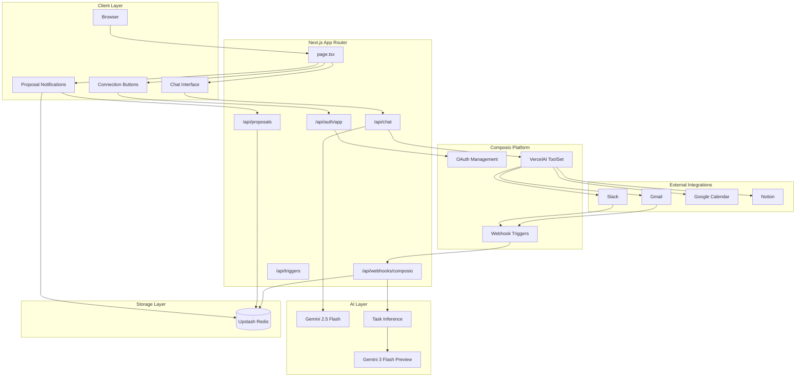
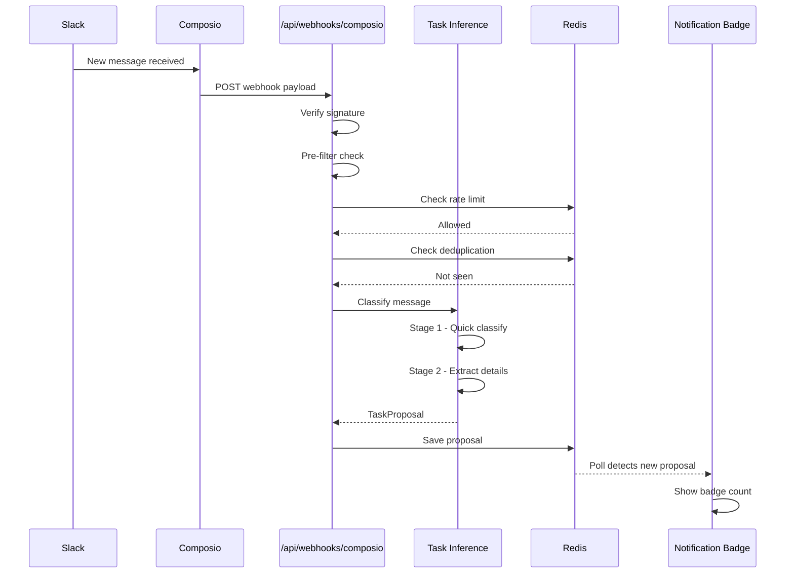
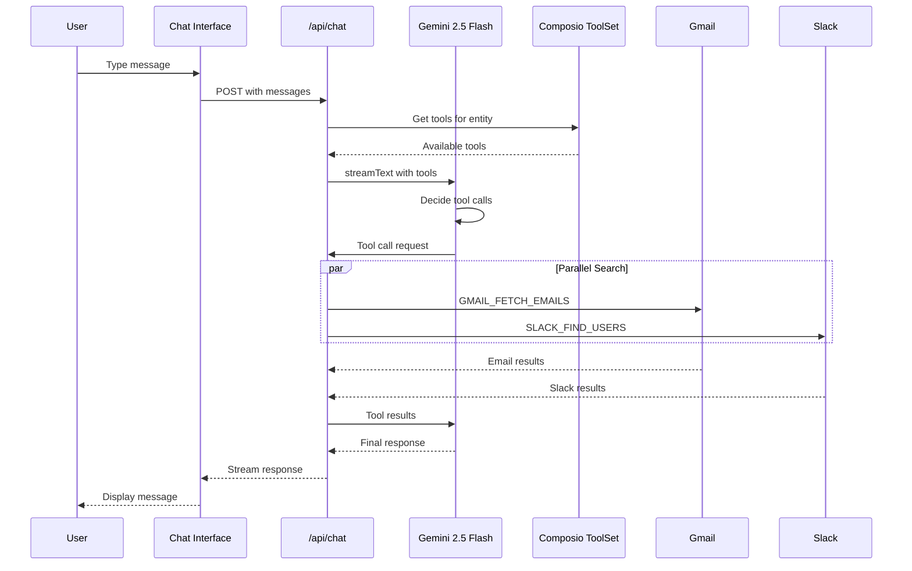
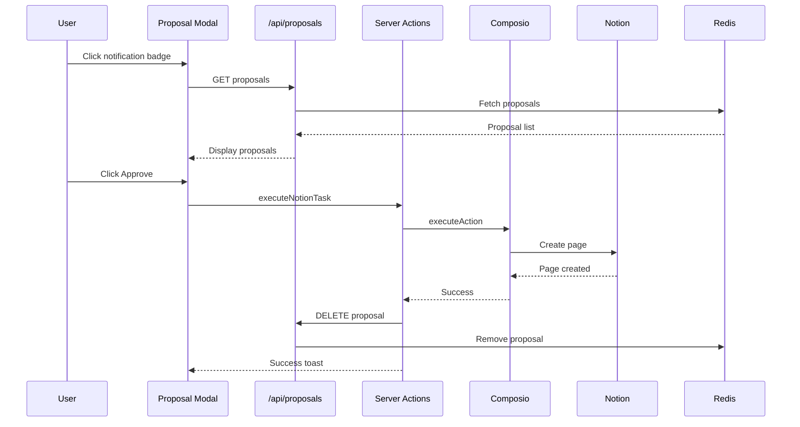

# Orbital System Architecture

## High-Level Overview

---

## Component Details

### Frontend Components

| Component | File | Purpose |
|-----------|------|---------|
| Main Page | `app/page.tsx` | Entry point, manages entity ID and connections |
| Chat Interface | `app/components/ChatInterface.tsx` | Interactive AI chat with streaming |
| Connect Button | `app/components/ConnectButton.tsx` | OAuth connection for each app |
| Proposal Notification | `app/components/ProposalNotification.tsx` | Badge + modal for HITL confirmations |
| HITL Card | `app/components/HITLCard.tsx` | Displays pending task/event proposals |

### API Routes

| Route | Method | Purpose |
|-------|--------|---------|
| `/api/chat` | POST | AI chat with function calling |
| `/api/proposals` | GET | Fetch pending proposals for user |
| `/api/proposals` | DELETE | Remove/dismiss a proposal |
| `/api/auth/[app]` | GET | Initiate OAuth flow via Composio |
| `/api/webhooks/composio` | POST | Receive incoming message webhooks |
| `/api/triggers` | POST/DELETE | Manage Composio webhook triggers |

### Core Libraries

| File | Purpose |
|------|---------|
| `app/lib/taskInference.ts` | Two-stage AI task detection |
| `app/lib/composio.ts` | Composio client utilities |
| `app/lib/kv.ts` | Redis operations (proposals, dedup, rate limiting) |
| `app/lib/types.ts` | TypeScript type definitions |
| `app/actions.ts` | Server actions for confirmed executions |

---

## Data Flow 1: Passive Task Detection

---

## Data Flow 2: Interactive Chat

---

## Data Flow 3: HITL Confirmation

---

## Storage Schema (Redis)

| Key Pattern | Type | TTL | Purpose |
|-------------|------|-----|---------|
| `proposals:{entityId}` | List | 7 days | Pending task proposals |
| `seen:{messageHash}` | String | 1 hour | Message deduplication |
| `settings:{entityId}:{key}` | String | None | User settings (e.g., Notion DB ID) |
| `ratelimit:{entityId}` | Counter | 60 sec | Rate limiting (10 req/min) |

---

## AI Model Usage

| Model | Location | Purpose | Max Tokens |
|-------|----------|---------|------------|
| `gemini-3-flash-preview` | `taskInference.ts` | Task classification | 50 |
| `gemini-3-flash-preview` | `taskInference.ts` | Task extraction (structured) | Default |
| `gemini-2.5-flash` | `chat/route.ts` | Chat with function calling | Default |

> **Note**: Gemini 3 Flash doesn't support function calling with the current SDK version (requires thought signatures). Use Gemini 2.5 Flash for tool use.

---

## Security Features

- **Webhook Signature Verification** - HMAC-SHA256 validation
- **Rate Limiting** - 10 requests/minute per entity
- **Message Deduplication** - Hash-based duplicate detection
- **Entity Isolation** - All data scoped to entity ID
- **Human-in-the-Loop** - Write operations require explicit confirmation
- **Read-Only Tool Filtering** - Chat API filters out destructive actions

---

## Technology Stack

| Layer | Technology |
|-------|------------|
| Frontend | Next.js 14, React, Framer Motion, Tailwind CSS |
| Backend | Next.js API Routes (Node.js runtime) |
| AI | Vercel AI SDK, Google Gemini API |
| Integrations | Composio (OAuth + tool execution) |
| Storage | Upstash Redis |
| Deployment | Vercel (recommended) |
