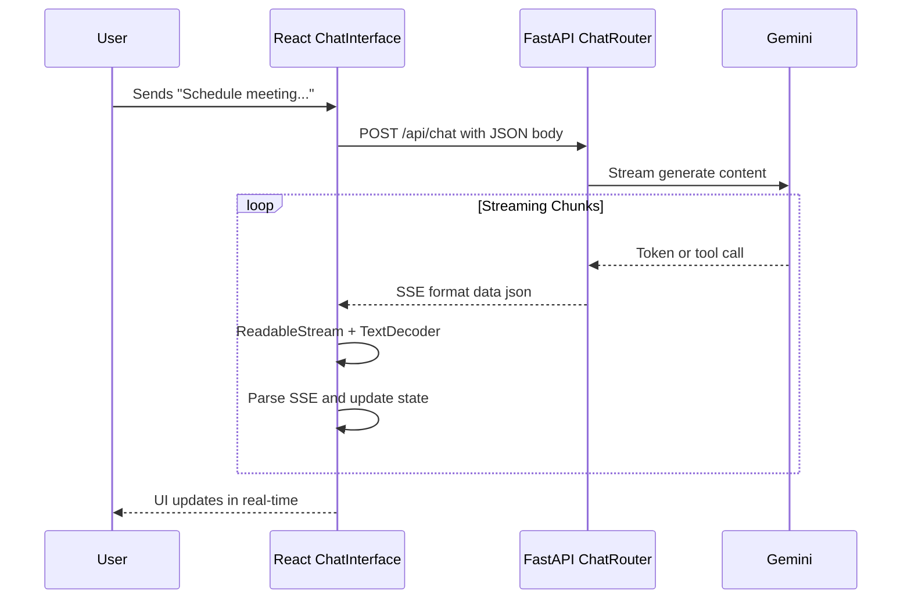
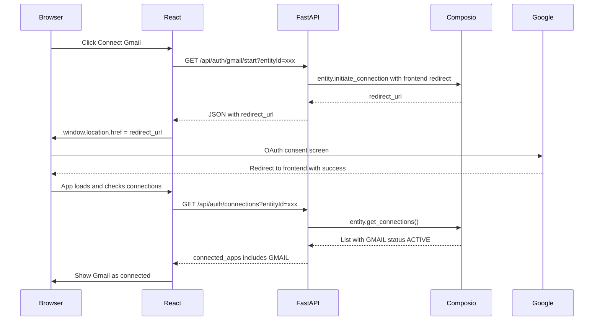

# Orbital: Python + React Architecture Rebuild

> **Important Technical Notes:**
> - SSE streaming uses `fetch` + `ReadableStream` on frontend (NOT `EventSource` which only supports GET)
> - Type safety maintained via `openapi-ts` auto-generation from FastAPI's OpenAPI spec
> - Gemini structured output uses Pydantic models with `response_mime_type="application/json"`

## Architecture Overview

```mermaid
flowchart TB
    subgraph frontend [React + Vite Frontend - Port 5173]
        App[App.tsx]
        ChatUI[ChatInterface]
        ConnectBtns[ConnectButton]
        ProposalModal[ProposalNotification]
        Hooks[Custom Hooks]
    end

    subgraph backend [FastAPI Backend - Port 8000]
        AuthRouter["/api/auth/{app}"]
        ChatRouter["/api/chat"]
        ProposalsRouter["/api/proposals"]
        WebhookRouter["/api/webhooks/composio"]
        TriggersRouter["/api/triggers"]
    end

    subgraph services [Python Services]
        ComposioSvc[ComposioService]
        GeminiSvc[GeminiService]
        TaskInference[TaskInferenceService]
        RedisSvc[RedisService]
    end

    subgraph external [External Services]
        Composio[Composio API]
        Gemini[Gemini API]
        Redis[(Redis/Upstash)]
        Gmail[Gmail]
        Slack[Slack]
        Calendar[Google Calendar]
        Notion[Notion]
    end

    App --> ChatUI
    App --> ConnectBtns
    App --> ProposalModal

    ChatUI -->|POST /api/chat| ChatRouter
    ConnectBtns -->|GET /api/auth/{app}| AuthRouter
    ProposalModal -->|GET/DELETE /api/proposals| ProposalsRouter

    ChatRouter --> GeminiSvc
    ChatRouter --> ComposioSvc
    AuthRouter --> ComposioSvc
    WebhookRouter --> TaskInference
    ProposalsRouter --> RedisSvc

    ComposioSvc --> Composio
    GeminiSvc --> Gemini
    RedisSvc --> Redis
    Composio --> Gmail
    Composio --> Slack
    Composio --> Calendar
    Composio --> Notion
```

---

## Project Structure

```
orbital-python/
├── frontend/                          # React + Vite + TypeScript
│   ├── src/
│   │   ├── components/
│   │   │   ├── ChatInterface.tsx      # Port from current app
│   │   │   ├── ConnectButton.tsx      # Modified for API calls
│   │   │   ├── MessageBubble.tsx
│   │   │   ├── ProposalNotification.tsx
│   │   │   ├── HITLCard.tsx
│   │   │   └── ToolStatusBadge.tsx
│   │   ├── hooks/
│   │   │   ├── useEntityId.ts
│   │   │   ├── useProposals.ts
│   │   │   └── useChat.ts             # New: handle SSE streaming
│   │   ├── lib/
│   │   │   ├── api.ts                 # API client for backend
│   │   │   ├── types.ts
│   │   │   └── utils.ts
│   │   ├── App.tsx
│   │   ├── main.tsx
│   │   └── index.css                  # Tailwind styles
│   ├── index.html
│   ├── vite.config.ts
│   ├── tailwind.config.js
│   ├── tsconfig.json
│   └── package.json
│
├── backend/                           # FastAPI + Python
│   ├── app/
│   │   ├── __init__.py
│   │   ├── main.py                    # FastAPI app, CORS, lifespan
│   │   ├── config.py                  # Pydantic settings
│   │   ├── routers/
│   │   │   ├── __init__.py
│   │   │   ├── auth.py                # OAuth via Composio
│   │   │   ├── chat.py                # Gemini + tool execution
│   │   │   ├── proposals.py           # HITL proposal CRUD
│   │   │   ├── webhooks.py            # Composio webhook receiver
│   │   │   └── triggers.py            # Manage webhook subscriptions
│   │   ├── services/
│   │   │   ├── __init__.py
│   │   │   ├── composio_service.py    # Composio client wrapper
│   │   │   ├── gemini_service.py      # Gemini API wrapper
│   │   │   ├── redis_service.py       # All Redis operations
│   │   │   └── task_inference.py      # Two-stage AI classification
│   │   └── models/
│   │       ├── __init__.py
│   │       └── schemas.py             # Pydantic models
│   ├── requirements.txt
│   ├── .env.example
│   └── Dockerfile                     # Optional: containerization
│
├── docker-compose.yml                 # Optional: local Redis + services
└── README.md
```

---

## Phase 1: Backend Foundation

### 1.1 Project Setup and Dependencies

Create `backend/requirements.txt`:

```
fastapi>=0.109.0
uvicorn[standard]>=0.27.0
composio-core>=0.6.0
google-generativeai>=0.8.0
redis>=5.0.0
python-dotenv>=1.0.0
sse-starlette>=2.0.0
pydantic>=2.0.0
pydantic-settings>=2.0.0
httpx>=0.27.0
```

### 1.2 Core Application Structure

Create `backend/app/main.py` with:

- FastAPI app initialization
- CORS middleware configured for frontend origin
- Router registration for all endpoints
- Lifespan handler for Redis connection management

Create `backend/app/config.py` with Pydantic Settings for:

- `COMPOSIO_API_KEY`
- `GOOGLE_GENERATIVE_AI_API_KEY`
- `REDIS_URL` (or Upstash REST URL/token)
- `FRONTEND_URL` (for OAuth redirects)
- `WEBHOOK_SECRET` (for signature verification)

### 1.3 Redis Service

Port [app/lib/kv.ts](app/lib/kv.ts) to `backend/app/services/redis_service.py`:

- `add_proposal()` - LPUSH with 7-day TTL
- `get_proposals()` - LRANGE
- `remove_proposal()` - LREM
- `get_proposal_count()` - LLEN
- `has_seen_message()` / `mark_message_seen()` - deduplication
- `check_rate_limit()` - INCR with sliding window
- `get/set/delete_user_setting()`

> **Persistence Note:** Redis stores proposals ephemerally. If Redis restarts, pending HITL approvals are lost. For production, either:
> - Enable AOF (Append Only File) persistence on Redis
> - Accept that proposals are ephemeral (users can re-trigger)
> - Future: Add SQLite/Postgres for durable proposal storage

---

## Phase 2: OAuth and Connections

### 2.1 Auth Router

Create `backend/app/routers/auth.py` with two endpoints:

**GET `/api/auth/{app}/start`**

- Accept `entityId` query param
- Initialize Composio client
- Call `entity.initiate_connection(app_name, redirect_url=FRONTEND_URL)`
- Return JSON with `redirect_url` (frontend handles redirect)

> **Critical:** The `redirect_url` passed to Composio must be the **Frontend URL** (e.g., `http://localhost:5173/`), not the backend. After OAuth completes, the provider redirects the user back to the frontend, which then polls for connection status.

**GET `/api/auth/connections`**

- Accept `entityId` query param
- Call `entity.get_connections()`
- Return list of connected app names with ACTIVE status

### 2.2 Composio Service

Create `backend/app/services/composio_service.py`:

- Singleton Composio client initialization
- `get_entity(entity_id)` helper
- `get_tools(entity_id, apps)` - fetch available tools
- `execute_action(entity_id, action, params)` - tool execution

---

## Phase 3: Chat with Gemini

### 3.1 Gemini Service

Create `backend/app/services/gemini_service.py`:

- Configure `google.generativeai` with API key
- Create chat model with tool support
- Handle streaming responses via async generator

### 3.2 Chat Router

Create `backend/app/routers/chat.py`:

**POST `/api/chat`**

- Accept messages array in body
- Read `x-entity-id` header
- Fetch Composio tools, filter to read-only actions
- Add custom `propose_calendar_event` tool for HITL
- Build system prompt with current date/time
- Stream response as `text/event-stream` (SSE format)
- Handle tool calls by executing via Composio and feeding results back

Key implementation detail - streaming with `StreamingResponse`:

```python
from fastapi.responses import StreamingResponse

async def generate():
    async for chunk in gemini_service.stream_chat(messages, tools):
        # SSE format: "data: {...}\n\n"
        yield f"data: {json.dumps(chunk)}\n\n"
    yield "data: [DONE]\n\n"

return StreamingResponse(
    generate(),
    media_type="text/event-stream",
    headers={"Cache-Control": "no-cache", "Connection": "keep-alive"}
)
```

---

## Phase 4: HITL Proposals

### 4.1 Proposals Router

Create `backend/app/routers/proposals.py`:

**GET `/api/proposals`**

- Accept `entityId` query param
- Return all pending proposals from Redis

**DELETE `/api/proposals/{proposal_id}`**

- Accept `entityId` query param
- Remove proposal from Redis
- Return success/failure

**POST `/api/proposals/execute`**

- Accept proposal data + action type
- Execute via Composio (create calendar event, create Notion page)
- Remove proposal after successful execution

---

## Phase 5: Webhooks and Task Inference

### 5.1 Task Inference Service

Port [app/lib/taskInference.ts](app/lib/taskInference.ts) to `backend/app/services/task_inference.py`:

- Stage 1: Quick classification (is this actionable?)
- Stage 2: Extract structured task details using Pydantic models

Leverage Gemini's native structured output with Pydantic:

```python
# backend/app/models/schemas.py
from pydantic import BaseModel
from typing import Optional
from enum import Enum

class TaskType(str, Enum):
    CALENDAR_EVENT = "calendar_event"
    NOTION_TASK = "notion_task"
    REMINDER = "reminder"

class ExtractedTask(BaseModel):
    task_type: TaskType
    title: str
    description: Optional[str] = None
    due_date: Optional[str] = None
    attendees: list[str] = []
    confidence: float

# In task_inference.py - use generation_config
response = model.generate_content(
    prompt,
    generation_config=genai.GenerationConfig(
        response_mime_type="application/json",
        response_schema=ExtractedTask
    )
)
```

### 5.2 Webhook Router

Create `backend/app/routers/webhooks.py`:

**POST `/api/webhooks/composio`**

- Verify HMAC-SHA256 signature
- Pre-filter messages (skip bot messages, system notifications)
- Check rate limit
- Check deduplication
- Run task inference
- If actionable, save proposal to Redis

### 5.3 Triggers Router

Create `backend/app/routers/triggers.py`:

**POST `/api/triggers`**

- Subscribe entity to Composio webhook triggers (SLACK_NEW_MESSAGE, GMAIL_NEW_EMAIL)

**DELETE `/api/triggers`**

- Unsubscribe entity from triggers

---

## Phase 6: React Frontend

### 6.1 Vite Project Setup

Initialize with:

```bash
npm create vite@latest frontend -- --template react-ts
cd frontend
npm install tailwindcss postcss autoprefixer framer-motion lucide-react
```

### 6.2 API Client

Create `frontend/src/lib/api.ts`:

- `initiateOAuth(app, entityId)` - returns redirect URL
- `getConnections(entityId)` - returns connected apps
- `streamChat(messages, entityId, onChunk)` - fetch + ReadableStream (see below)
- `getProposals(entityId)`
- `dismissProposal(proposalId, entityId)`
- `executeProposal(proposal, entityId)`

> **Critical Fix:** Do NOT use `EventSource` - it only supports GET requests. Use `fetch` with `ReadableStream`:

```typescript
// frontend/src/lib/api.ts
export async function streamChat(
  messages: Message[],
  entityId: string,
  onChunk: (chunk: ChatChunk) => void
): Promise<void> {
  const response = await fetch(`${API_URL}/chat`, {
    method: 'POST',
    headers: {
      'Content-Type': 'application/json',
      'x-entity-id': entityId,
    },
    body: JSON.stringify({ messages }),
  });

  if (!response.ok || !response.body) {
    throw new Error('Stream failed');
  }

  const reader = response.body.getReader();
  const decoder = new TextDecoder();
  let buffer = '';

  while (true) {
    const { done, value } = await reader.read();
    if (done) break;

    buffer += decoder.decode(value, { stream: true });

    // Parse SSE format: "data: {...}\n\n"
    const lines = buffer.split('\n\n');
    buffer = lines.pop() || ''; // Keep incomplete chunk

    for (const line of lines) {
      if (line.startsWith('data: ')) {
        const data = line.slice(6);
        if (data === '[DONE]') return;
        onChunk(JSON.parse(data));
      }
    }
  }
}
```

### 6.3 Component Ports

Port existing components from [app/components/](app/components/) with modifications:

| Component | Key Changes |

|-----------|-------------|

| `ChatInterface.tsx` | Replace `useChat` hook with custom SSE handler |

| `ConnectButton.tsx` | Call API then `window.location.href` to redirect URL |

| `ProposalNotification.tsx` | Use `api.getProposals()` instead of server action |

| `HITLCard.tsx` | Call `api.executeProposal()` on approve |

| `MessageBubble.tsx` | Minimal changes |

### 6.4 Custom Hooks

Create `frontend/src/hooks/useChat.ts`:

- Manage message history state
- Call `streamChat()` with chunk callback
- Accumulate text chunks into assistant message
- Handle tool call/result events from stream
- Expose `sendMessage()`, `messages`, `isLoading` state

Port `useEntityId.ts` and `useProposals.ts` with API calls instead of server actions.

### 6.5 Type Safety with openapi-ts

Add auto-generated TypeScript types from FastAPI's OpenAPI spec:

```bash
# Install
npm install -D @hey-api/openapi-ts

# Add to package.json scripts
"scripts": {
  "gen:types": "openapi-ts -i http://localhost:8000/openapi.json -o ./src/lib/api-types"
}
```

Run `npm run gen:types` after backend changes to sync Pydantic models to TypeScript interfaces automatically.

### 6.6 Styling

Port [app/globals.css](app/globals.css) to Tailwind config:

- Custom font (font-display)
- Gradient utilities (text-gradient)
- Animation classes (animate-spin-slow)

---

## Phase 7: Integration and Testing

### 7.1 Development Setup

1. Start Redis locally or configure Upstash credentials
2. Start backend: `uvicorn app.main:app --reload --port 8000`
3. Start frontend: `npm run dev` (port 5173)
4. Configure CORS to allow frontend origin

### 7.2 OAuth Flow Testing

1. Click Connect button in frontend
2. Verify redirect to OAuth provider
3. Complete OAuth flow
4. Verify redirect back to frontend
5. Verify connection status updates

### 7.3 Chat Flow Testing

1. Send message in chat
2. Verify SSE stream receives chunks
3. Verify tool calls execute and return results
4. Test parallel tool calls (search Gmail + Slack)

---

## Data Flow: Chat Streaming (fetch + ReadableStream)



---

## Data Flow: OAuth



---

## Environment Variables

**Backend `.env`:**

```
COMPOSIO_API_KEY=your_composio_key
GOOGLE_GENERATIVE_AI_API_KEY=your_gemini_key
REDIS_URL=redis://localhost:6379
# Or for Upstash:
UPSTASH_REDIS_REST_URL=https://xxx.upstash.io
UPSTASH_REDIS_REST_TOKEN=xxx
FRONTEND_URL=http://localhost:5173
WEBHOOK_SECRET=your_webhook_secret
```

**Frontend `.env`:**

```
VITE_API_URL=http://localhost:8000/api
```

---

## Deployment Notes

- **Frontend**: Deploy to Vercel, Netlify, or any static host
- **Backend**: Deploy to Railway, Fly.io, Render, or any Python host
- **Redis**: Continue using Upstash (serverless Redis)
- Update `FRONTEND_URL` and `VITE_API_URL` for production domains
- Configure webhook URL in Composio dashboard to point to production backend